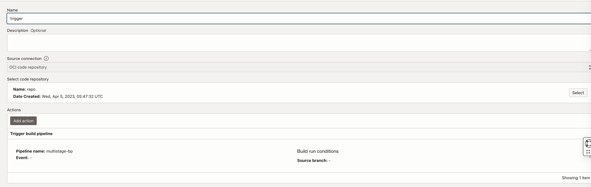

## A minimal sample to explain docker multistage build from `OCI Devops Build pipeline`

### How to use the sample

- Create an OCI Dynamic group with below rule.

```java
ALL {resource.type = 'devopsbuildpipeline', resource.compartment.id = 'OCID OF YOUR COMPARTMENT'}
```

- Create an OCI Identiy polcy with below statements.

```java
Allow dynamic-group <NAME OF THE DYNAMIC GROUP> to manage ons-topics in compartment <NAME OF THE COMPARTMENT>
```

#### OCI Devops Setup

- Create an OCI Notification topic - https://docs.oracle.com/en-us/iaas/Content/Notification/Tasks/create-topic.htm#top
- Create a DevOps project and associate it with the notification.


- Enable logs for the project.

- Create a code repo. - https://docs.oracle.com/en-us/iaas/Content/devops/using/create_repo.htm#create_repo

- Push the content to the code repo over HTTPS or ssh protocol.

- Create a Build pipeline - https://docs.oracle.com/en-us/iaas/Content/devops/using/create_buildpipeline.htm#create_buildpipeline


- Within the build pipeline add a stage of type `Managed Build`.Associate with the code repo as the Primary code repository.


- Create an OCI Trigger and associate the code repo and the build pipeline created - https://docs.oracle.com/en-us/iaas/Content/devops/using/trigger_build.htm



#### Test the sample

- Add a line to `README.md` and push the content back to code repo .This will trigger a build job automatically.


- Follow the build run. Here we are using a `java` and a `js` sample with multi stage docker build.The build steps and stages can be expanded /updated accordingly. This sample is made only for a demo purpose.


### Contributor 

- Author: Rahul M R.
- Collaborators : NA
- Last release: April 2023